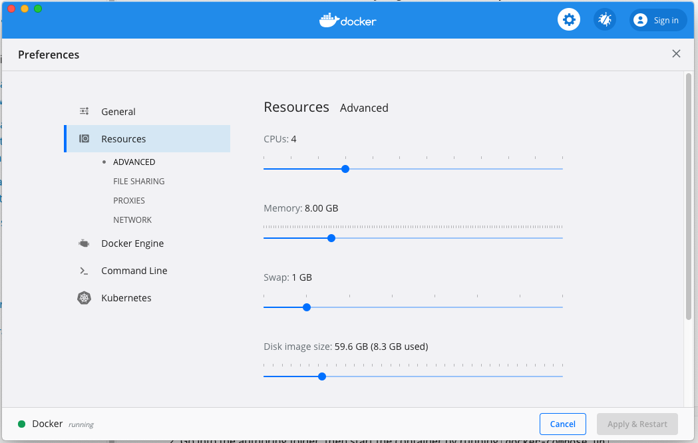

# Crafter CMS Docker Compose

This project provides Docker compose files that allow you to run Docker containers for the following Crafter CMS 
environments:

* Authoring
* Delivery
* Serverless Delivery (external Elasticsearch service and content stored in S3)

**NOTE:** These files are intended for development use only. We recommend you create your own set of Docker compose
files for production and use these as a reference.

# Pre-requisites

1. Install Docker (https://docs.docker.com/install/)
2. Install Docker Compose (https://docs.docker.com/compose/install/)

**For Windows and Mac, we recommend you give Docker Desktop at least 8GB of RAM and 4 CPUs. To do this, go to Docker 
Desktop's Settings > Advanced, and then change the resource limits.**

# Start Authoring Environment

1. `cd authoring`.
2. `docker-compose up` to run the containers in the foreground or `docker-compose up -d` to run them detached in the 
background.

# Start Delivery Environment

1. Start the Authoring environment.
2. `cd delivery`.
3. `docker-compose up` to run the containers in the foreground or `docker-compose up -d` to run them detached in the 
background.

## Create a Delivery Site

1. `cd delivery`.
2. `docker-compose exec deployer gosu crafter ./bin/init-site.sh <SITE_NAME> /data/authoring/repos/sites/<SITE_NAME>/published` 
(remember to replace `<SITENAME>` for the actual site name).

## Delete a Delivery Site

1. `cd delivery`.
2. `docker-compose exec deployer gosu crafter ./bin/remove-site.sh <SITE_NAME>` (remember to replace `<SITE_NAME>` for 
the actual site name).

# Start Serverless Delivery Environment

1. Start the Authoring environment.
2. Follow https://docs.craftercms.org/en/3.1/system-administrators/activities/delivery/setup-serverless-site.html from
*Step 1: Create the site in the authoring environment* to *Step 3: Create the AWS Target in Authoring Crafter Deployer*.
Don't do *Step 4: Configure the Delivery Crafter Engine for Serverless Mode*.
3. `cd serverless/s3/delivery`.
4. Specify in the `serverless/s3/delivery/.env` file the required environment variables: 
   - **ES_URL:** The AWS Elasticsearch endpoint (or any other valid Elasticsearch URL).
   - **crafter.engine.site.default.rootFolder.path:** The URL to the S3 bucket with the sites. Format is 
     `s3://<BUCKET_NAME>/<SITES_ROOT>/{siteName}`. Example: `s3://serverless/sites/{siteName}`.
   - **crafter.engine.s3.region:** The AWS region of the S3 bucket.
   - **crafter.engine.s3.accessKey:** The AWS access key.
   - **crafter.engine.s3.secretKey:** The AWS secret key.
5. `docker-compose up` to run the containers in the foreground or `docker-compose up -d` to run them detached in the 
background.

# Backup Authoring/Delivery

1. Make sure the authoring/delivery environment is down (`docker-compose down`).
2. `cd` to the authoring/delivery compose project folder.
3. `docker-compose run --rm --no-deps -v /host/path/to/backups:/opt/crafter/backups tomcat backup`. E.g.
`docker-compose run --rm --no-deps -v C:/Users/jdoe/Documents/Backups:/opt/crafter/backups tomcat backup`

**NOTE:** In Windows, make sure `/host/path/to/backups` points to a path in a shared drive (check Docker Desktop's 
Settings > Shared Drives)

# Restore Authoring/Delivery

1. Make sure the authoring/delivery environment is down. (`docker-compose down`).
2. `cd` to the authoring/delivery compose project folder.
3. `docker-compose run --rm --no-deps -v /host/path/to/backups:/opt/crafter/backups tomcat restore ./backups/<BACKUP_NAME>`.
E.g. `docker-compose run --rm --no-deps -v C:/Users/jdoe/Documents/Backups:/opt/crafter/backups tomcat restore ./backups/crafter-authoring-backup.2019-03-28-00-58-33.zip`

**NOTE:** In Windows and Mac, make sure `/host/path/to/backups` points to a path in a shared drive (check Docker 
Desktop's Settings > Shared Drives)

# Run a command inside a running container

Running scripts or single commands inside a running container is pretty easy:

1. `cd` to the authoring/delivery compose project folder.
2. `docker-compose exec <SERVICE_NAME> gosu crafter <CMD> <PARAMETERS>`

E.g.

`docker-compose exec deployer gosu crafter ./bin/init-site.sh mysite /data/authoring/repos/sites/mysite/published`

For each authoring and delivery compose files there are 3 services:

- `elasticsearch`
- `tomcat`
- `deployer`

For serverless S3 delivery there's only one service: `tomcat`.

Please **ALWAYS** use `gosu crafter` with `docker-compose exec`. This ensures that all the commands are run as the 
`crafter` user and that all new files and directories created belong to `crafter` (`gosu` is basically a version
of `sudo` that works better on Docker).

# Open a shell to a container

Sometimes you'll need to get a shell to a container for debugging purposes. To do this, run the following command:

`docker exec -it <CONTAINER_NAME> gosu crafter bash`

This will open a Bash shell as the crafter user. The current directory will be `/opt/crafter`.
